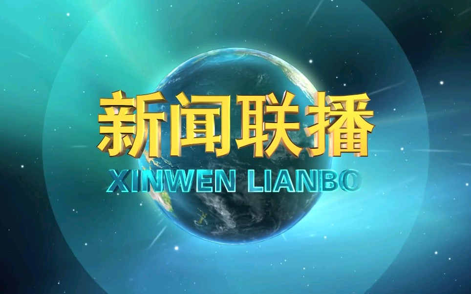

# CAS-VSR-S68

## Introduction
CAS-VSR-S68 is a lip reading dataset designed for evaluating the challenging setting where the speech content is highly diverse, involving almost all common Chinese characters while the number of speakers is limited. The data is collected from over 10 years of the "News Broadcast" program, but with only 11 hosts as the speakers.  

## Data Description
The video clips of each speech are provided in the format of visual frames, which are given at a reduced resolution of 96x96 pixels, focusing solely on the lip region. 
Each clip's speech content includes Chinese characters, *pinyin* transcriptions, start and end time of each character and word, as well as the total number of characters and words. For more details, please refer to an example utterance provided in "[Example Utterance](###example-utterance)".

### Example Frames
Below are example frames from the dataset showing the lip region at the provided resolution of 96x96 pixels:

**Speaker 1:**

**Speaker 6:**

**Speaker 10:**

**Speaker 11:**

### Example Utterance
Here is the corresponding transcript for a particular sample.
```
full_align
1
num_tokens,num_words
6,2
sentence
意见主要目标
pinyin
y@i_4 j@ian_4 zh@u_3 y@ao_4 m@u_4 b@iao_1
token,start,end,pinyin
意,48.33,48.54,y@i_4
见,48.54,48.80,j@ian_4
主,48.80,48.98,zh@u_3
要,48.98,49.13,y@ao_4
目,49.13,49.29,m@u_4
标,49.29,49.79,b@iao_1
word,token_start,token_end
意见,0,2
主要目标,2,6
```

### Duration Distribution
The dataset totals approximately 68 hours. The following table illustrates the distribution of video clip durations within the dataset:
| Speaker | Total Duration (min) |
|---------|----------------------|
| S1      | 708.85               |
| S2      | 671.99               |
| S3      | 621.02               |
| S4      | 584.59               |
| S5      | 461.52               |
| S6      | 324.00               |
| S7      | 294.03               |
| S8      | 171.56               |
| S9      | 143.19               |
| S10     | 82.91                |
| S11     | 39.21                |
| **Total** | **4103.37(68.3h)**       |

### Dataset Split
By default, the data of 10 speakers are used for training, and one speaker for adaptation and testing each time. In the paper accompanying the dataset, "Learning Separable Hidden Unit Contributions for Speaker-Adaptive Visual Speech Recognition", speaker 6 (Male) and speaker 10 (Female) are used for evaluation separately. The results are as below.


#### Results of using Speaker 6 (Male) as the adaptation and test set:
| Adapt (min) | Baseline (%) | Proposed Method (LSHUC) (%) |
|-------------|--------------|---------------------|
| 0                  | 19.61    | 19.37           |
| 1                  | 21.53    | 20.69           |
| 3                  | 18.65    | 18.55           |
| 5                  | 17.55    | **16.72**           |

#### Results of using Speaker 10 (Female) as the adaptation and test set:
| Adapt (min) | Baseline (%) | Proposed Method (LSHUC) (%) |
|-------------|--------------|---------------------|
| 0           | 44.93        | 43.24               |
| 1           | 38.63        | 37.38               |
| 3           | 36.37        | 35.64               |
| 5           | 33.79        | **33.17**               |

For more results, please refer to the [paper](https://arxiv.org/abs/2310.05058) or [GitHub repo](https://github.com/jinchiniao/LSHUC).

## Accessing the Dataset

To access the CAS-VSR-S68 dataset, please scan the signed agreement [here](CAS-VSR-S68-Release Agreement-v3.pdf) and send it to [lipreading@vipl.ict.ac.cn](mailto:lipreading@vipl.ict.ac.cn). **Please note that the dataset is only available to universities and research institutes for research purposes only.** Note that the agreement should be signed by **a full-time staff member (usually your tutor).**  Sharing the dataset with others is **not allowed** under the terms of the agreement.

## File Structure and Contents
After downloading the zip files, please extract them using the following commands:
```
cat CAS-VSR-S68.tar.gz* > CAS-VSR-S68.tar.gz
tar -xzvf CAS-VSR-S68.tar.gz 
```
### `lip_imgs` (Lip Images) 
For each sample, the lip region image sequence corresponding to each utterance is stored in a zip file. You can extract them with the following command:
```
unzip lip_imgs/*.zip
```
This directory contains folders of lip region images. Each folder is named with a unique identifier (UUID) of the video clip and contains a sequence of ``.jpg` images.


Example:
```
lip_imgs/
├── 0a1ddef8-20e6-2e4b-c002-6cb6c5923585.zip
│ ├── 00000.jpg
│ ├── 00001.jpg
│ └── ...
```
### `utterance` (Corresponding Text) 
This directory includes transcription files corresponding to the lip images. Each transcription file is associated with a specific face track sequence and is named using a combination of the UUID and track sequence number.

Example:
```
utterance/
├── 0a1ddef8-20e6-2e4b-c002-6cb6c5923585_00000
│ ├── 0001.txt
│ ├── 0002.txt
│ └── ...
```
### `uuid2spk.csv` (UUID to Speaker Mapping)
A CSV file that maps each utterance identifier (UUID) to a speaker identifier.
This layout gives users a clear picture of the dataset's organization and how to locate specific pieces of information within it.

### `CAS-VSR-S68-Release Agreement-v3.pdf` (Agreement for Applying for Dataset)
This document contains the terms and conditions for accessing the CAS-VSR-S68 dataset. Interested parties must review and agree to the stipulations in this agreement before receiving authorization to access the dataset files.

## Data Privacy and Security
Due to data privacy and security concerns, and agreements made with the broadcasting company, only the lip region of the videos at a resolution of 96x96 pixels is available. Users are expected to comply with all guidelines and not distribute the data.

## Citation
If you use the CAS-VSR-S68 dataset in your research, please cite it as follows:
```bibtex
@inproceedings{Luo_2023_BMVC,
    author = {Songtao Luo and Shuang Yang and Shiguang Shan and Xilin Chen},
    title = {Learning Separable Hidden Unit Contributions for Speaker-Adaptive Visual Speech Recognition},
    booktitle = {34th British Machine Vision Conference 2023, {BMVC} 2023, Aberdeen, UK, November 20-24, 2023},
    publisher = {BMVA},
    year = {2023},
    url = {https://bmvc2022.mpi-inf.mpg.de/BMVC2023/0146.pdf}
}
